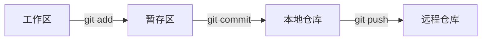

# Git是什么与第一次提交

> 本页属于：入门（basics）
> 前置知识：无
> 预计阅读时间：10 分钟
> provenance: source-derived
> last_verified: 2026-01-02

## 🎯 为什么需要这个？

你改了一个文件，第二天想找回昨天的版本，却发现已经被覆盖了。Git 就是用来记住“每一次改动”的工具，让你可以随时回到过去。

## 💡 一个类比

- 仓库（Repository）= 一本带时间轴的相册。
- 提交（Commit）= 按一次快门，给当前状态拍一张快照。[C01]
- 分支（Branch）= 相册里的一个平行相册，可以先试错，不影响主线。

## 🐍 最小必要知识

先记住四个词：

- 仓库（Repository）：存放项目历史的地方。
- 提交（Commit）：一次保存。
- 分支（Branch）：独立的开发线。
- 远程（Remote）：放在服务器上的仓库副本。

## 🖼️ 图解

<!-- FIGURE: F01 -->



图 1 工作区到远程仓库的流动。

> 本图由 Wiki 根据 E01 重绘（Conceptual illustration; not present in source.）。

## 🤖 真实场景

你正在写一份文档，想保留“初稿”和“修改稿”两个版本。用 Git 就不需要复制两份文件，改坏了也能回退。

## 📝 运行一个已有 demo

### 1. 安装 Git

```bash
git --version
```

如果没有安装，请按 [Git 官方安装文档](https://git-scm.com/book/zh/v2/起步-安装-Git) 操作。

### 2. 克隆一个仓库

```bash
git clone https://github.com/git/git.git
cd git
```

### 3. 做一次提交（在你自己的练习仓库里操作）

```bash
mkdir my-first-git && cd my-first-git
git init
echo "# 我的第一个 Git 仓库" > README.md
git add README.md
git commit -m "第一次提交"
git log --oneline
```

看到类似 `abc1234 第一次提交` 就说明你已经完成了第一次提交。

## ✨ Evidence

- 提交（Commit）把暂存区内容保存成一次快照：[C01] → [E01]。

## ✏️ 小练习

1. `git init` 做了什么？
2. `git add` 和 `git commit` 有什么区别？
3. 怎样查看提交历史？

<details>
<summary>📝 参考答案</summary>

1. 在当前目录初始化一个 Git 仓库，开始记录版本历史。
2. `git add` 把改动放进暂存区，`git commit` 把暂存区内容保存成一次提交。
3. 用 `git log --oneline` 查看。

</details>

## 本章小结

Git 是版本控制工具；仓库、提交、分支、远程是四个基础概念；跑通“安装 → 克隆/初始化 → 提交 → 查看历史”就完成了入门级。

## 下一步

- 上一页：无
- 下一页：实战（practice）（规划中）
- 返回：[[Home]]

## 更新日志

- 2026-01-02：创建本页（示例），含 claim/evidence 与派生图。