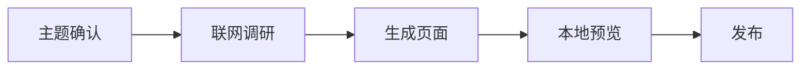

# 配图与 Mermaid 规范

清晰的 figure/illustration 是关键。本文件规定配图优先级、Figure Object 与 Figure Explanation。

## 优先级

1. **官方图**：官方文档/仓库里的截图、架构图、示意图（记录来源 URL + 访问日期）。
2. **可验证的网络图**：权威网站/知名博客的图，记录来源、访问日期、许可。
3. **自制 Mermaid**：找不到可靠图时用 Mermaid 画。
4. 严禁编造图片 URL；找不到可靠图就 Mermaid 或文字描述。

## Figure Object

每个重要图都应在 `_meta/figures.yaml` 中有 Figure Object：id、caption、source_type、source、source_locator、page_url、direct_image_url、local_asset、license、accessed_at、concept_ids、claim_ids、explanation、what_to_notice、related_figures、derived_from。规范见 references/figure-model.md。

## 图片规范

- 每张图有 caption：`图 1 某某架构图`。
- caption 后附来源与访问日期：`来源：<url>（访问于 YYYY-MM-DD）`。
- 本地化：重要图片下载到 `page/assets/images/`（或 `page/<grade>/assets/`），用相对路径引用；外链有失效风险。
- 发布注意：`publish-wiki.sh` 只复制 `*.md`；图片如需随 GitHub Wiki 发布，需单独托管（图床/仓库附件）或嵌入相对路径并同步发布。

## Figure Explanation 必须回答

1. 图展示什么？
2. 应该重点看哪里？
3. 每个轴 / 节点 / 箭头 / 区域是什么意思？
4. 图支持什么 claim？
5. 和哪个 concept 对应？
6. 为什么这张图值得放在这里？

禁止：只插 `` + caption + source，然后完全不解释。

## Mermaid 规范

- 本地 mkdocs 预览启用 `pymdownx.superfences` 并开启 mermaid（模板已配好），fenced code 标注 `mermaid`。
- GitHub Wiki **不渲染 Mermaid**：Mermaid 块会显示为代码。二选一：
  1. 接受“预览渲染、Wiki 显示代码”的降级；
  2. 把 Mermaid 导出为 PNG 放进 assets，再按图片规范引用。
- Mermaid 是 Derived Illustration，不是 source evidence：必须写明 `本图由 Wiki 根据 E12/E13/E14 重绘`，或 `Conceptual illustration; not present in source.`

## 课程截图（Course Mode）

- 记录 Lecture / Slide / Page / Figure region。
- 必要时裁切关键 figure，而不是只能整页截图。

## External Image

同时记录 page_url、direct_image_url、license/attribution、access_date。禁止只保存 direct image URL。

示例（本地预览会渲染成图）：

